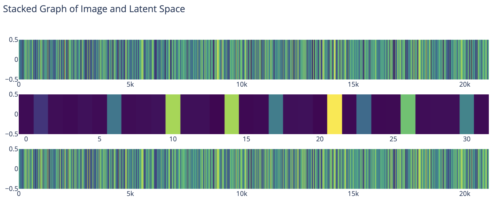
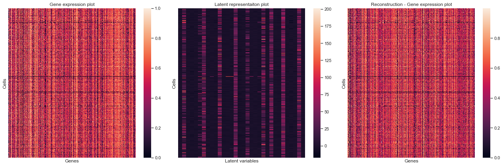
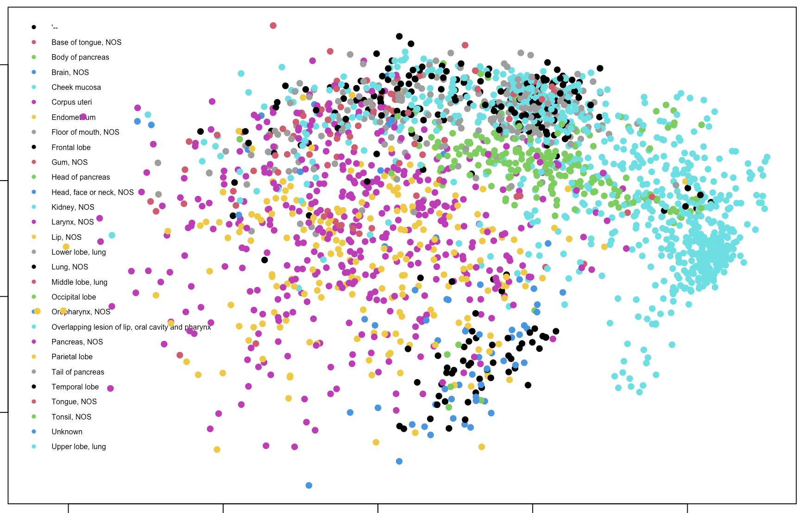
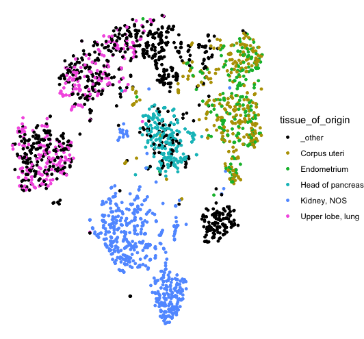

# Deep learning auto-encoding & analysis of genomic/transcriptomic data 

This project provides a pipeline for genomic/transcriptomic data analysis through purpose built tool in python and R.
Those tools are provided under the form of library for data processing, benchmarking, visualisation as well as python notebook coupled with R files for in depth analyses.

## Intro 

This project enables the analysis of genetic/transcriptomic dataset. Some preliminary steps are performed in R. The `LASSO.R` and `dataset_generation.R` files correspond to such analysis. It had the purpose of determining wether or not LASSO could be a good approach as well as some helpers script about dataset generation in R.

Those suffer from performance issues that have been hard to overcome due to the slow nature of R. The file `dataset_generation.R` tries to aliviate those limitations by providing lighter files to perform the analysis on.
 
## Data Helpers

The folder utils contain the script `data_handler.py` which is the main interface with our dataset. This is supplemented by some features contained in the file `feature_selection.py`.
On top of the minimum machinery necessary to build a tensorflow.dataset, it enables the user to tune feature selection and data engineering.
The following procedures are supported:

For patient selection :

- Study Phase selection
- Subsampling (for efficient testing on smaller dataset)
- Time point selection
- Aberration removal (NA's, incorrect gene count...)

For data driven feature engineering:

- Mean absolute deviation threshold/ceiling
- LASSO selection
- log1p transform
- Normalisation
- Min Max Scaling to [0,1]

For application specific feature engineering:

- genes symbols and possition can be retrieves an filtered on wether or not they are recognized
- symbols can then be sorted based on their position on the genome
- Some family of genes can be excluded, such as mythocondrial ones.

The dataset can then be output following 2 different architectures:

- Cell wise analysis, where each reading is considered on its own, without taking for account the fact that a given reading is a single observation from different time points linked to a patient.
- Time series analysis, we build sequences of time points for every patient

A transpose operation is also possible for time series, so we can decide weather or not to process genes as a sequence or as simple feature.

## Auto encoding

Throughout this project, we use multiple architectures to try to get any meaningful representation of the dataset.

All models built are available in the utils/models folder.

There you can find:

- Simple FC autoencoder `vanila_autoencoder.py`, very effective as a quick way to encode the dataset on a single observation basis
- FC Variational autoencoder `vae.py`, a first exploratory VAE that lead to similar results to the first one
- CNN autoencoder `cnn_encoder.py`, turned out pretty tricky to build over so many features
- Variational CNN autoencoder `ConvVAE.py`, to see if any improvement would be seen.
- LSTM autoencoder `LSTM.py`, to see if the long term dependancies could be handle by such architectures.

upcoming : 
- variational LSTM autoencoder

## The Notebooks

Each dataset as well as each network is studied in depth inside dedicated python notebooks.

On the dataset part you can find the folowing notebook where we break down the processing pipeline for data analysis:

- `Data_Analysis_cancer.ipynb`
- `Data_Analysis_genes.ipynb`
- `Data_Analysis_transcripts.ipynb`

And the following are dedicated to the different types of models:

- `FC_autoencoder.ipynb` most basic model
- `FC_VAE.ipynb`
- `cnn.ipynb` - 
- `ConVAE.ipynb`
- `LSTM.ipynb`
- `LSTM_transpose.ipynb`

Those notebook are mainly following the same step for each model architecture:

- building dataset
- building model
- fitting the model to the dataset
- monitoring the fit
- benchmarking the model against others
- providing some preliminary visualisation of the dataset latent space and reconstruction
- when needed, some troubleshooting steps to enlighten model weaknesses

Here you can see for a single cell : the orignial data, latent representation and reconstitution

Here you can see the entire dataset : the orignial data, latent representation and reconstitution

- generation and saving of the encoded dataset in a usable format

## Model Benchmarking

`benchmark.py` enables you to benchmark models over the same dataset, or different subsets of it (handles different number of features and entry points by averaging the loss function).

Models are then ranked and ploted on a complexity/loss plot.

## Post encoding analysis

This analysis is held in 3 R files located in the `post_training_analysis` folder. 

* `cell_encoding_analysis.R` dedicated to data encoded from cells
* `time_series_encoding_analysis.R` dedicated to data encoded from time series 
* `cancer_encoding_analysis.R` dedicated to data encoded from the cancer dataset 

as those 3 approaches requires slightly distincts analysis

The given analysis is composed of :

### PCA Visualisation

Here we proceed to Principal component analysis to see if the dataset is structured in clusters.

We also monitor different parameters of PCA before plotting the dataset into the projection space.

### t-SNE Visualisation

Here we proceed to build multiple plots, on a grid of parametters.

We then use an animated plot to search for a satisfactory representation.
