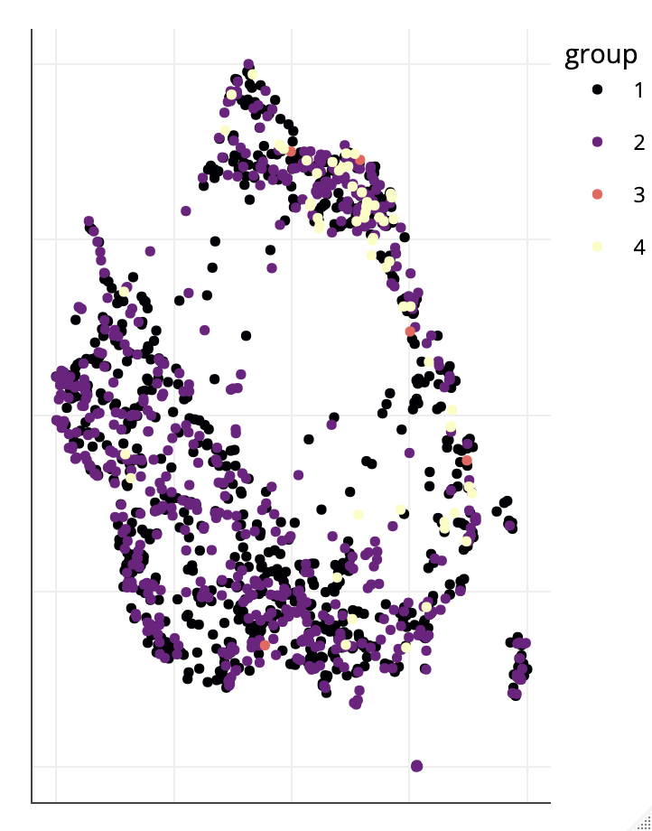

# Analysis of latent representation of RNA-seq Data for PD patient

## Intro 

This project enables the analysis of a dataset of single cell RNA seq. Some preliminary steps are performed in R. The LASSO.R file correspond to such analysis. It has the purpose of determining wether or not LASSO could be a good approach as well as some helpers script about dataset generation in R.

Those suffer from performance issues that have been hard to overcome due to the slow nature of R.

The following steps of the project are done inside python notebooks.

 
## Data Helpers

The folder utils contain the script data_handler.py which is the main interface with our dataset.
On top of the minimum machinery necessary to build a tensorflow.dataset, it enables the user to tune feature selection and data engineering.
The following procedures are supported:

For patient selection :

- Study Phase selection
- Subsampling (for efficient testing on smaller dataset)
- Time point selection
- Aberration removal (NA's, incorrect gene count...)

For gene selection/feature engineering:

- Mean absolute deviation threshold/ceiling
- LASSO selection
- min max scaling
- Normalisation
- log1p transform

The dataset can then be output following 2 different architectures:

- Single time point, where each reading is considered on its own, without taking for account the fact that a given reading is a single observation from different time points linked to a patient.
- Time series analysis, we build sequences of time points for every patient

A transpose operation is also possible for time series, so we can decide weather or not to process genes as a sequence or as simple feature.

## Auto encoding

Throughout this project, we use multiple architectures to try to get any meaningful representation of the dataset.

All models built are available in the utils/models folder.

There you can find:

- Simple FC autoencoder 'vanila_autoencoder.py', very effective as a quick way to encode the dataset on a single observation basis
- FC Variational autoencoder 'vae.py', a first exploratory VAE that lead to similar results to the first one
- CNN autoencoder 'cnn_encoder.py', turned out pretty tricky to build over so many features
- Variational CNN autoencoder 'ConvVAE.py', to see if any improvement would be seen.
- LSTM autoencoder 'LSTM.py', to see if the long term dependancies could be handle by such architectures.

upcoming : 
- variational LSTM autoencoder

## The Notebooks

Each time of network is studied in depth inside dedicated python notebooks.

Those notebook are mainly following the same step for each model architecture:

- building dataset
- building model
- fitting the model to the dataset
- monitoring the fit
- providing some preliminary visualisation of the dataset latent space and reconstruction
- when needed, some troubleshooting steps to enlighten model weaknesses
- generation and saving of the encoded dataset in a usable format

## Post encoding analysis

This analysis is held in 2 R files. One being dedicated to time series, the other to single point observations, as those 2 approaches requires slightly distincts analysis.

The proposed analysis is composed of :

### PCA Visualisation

Here we proceed to Principal component analysis to see if the dataset is structured in clusters.
We also monitor different parameters of PCA before plotting the dataset into the projection space.

### t-SNE Visualisation

Here we proceed to build multiple plots, on a grid of parametters.

We then use an animated plot to search for a satisfactory representation.
